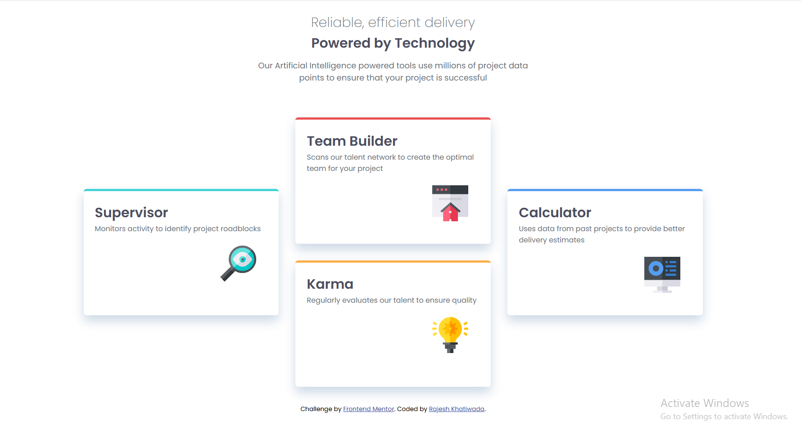

# Four Card Feature Section

A responsive feature section built as part of the Frontend Mentor challenge.  
This project focuses on improving layout structuring, responsive grid design, and positioning multiple UI cards in a clean and balanced way using HTML and CSS.

---

## 📸 Screenshot



---

## 🛠️ Built With

- HTML5
- CSS3
- CSS Grid
- Flexbox
- CSS Variables
- Responsive Design
- Mobile-first workflow

---

## 📌 Features

- Clean feature section layout with 4 distinct cards
- Advanced grid-based positioning for responsive design
- Balanced card alignment for desktop and mobile views
- Hover effects for interactive UI feel
- Pixel-perfect implementation of challenge design

---

## 📁 Project Structure


four-card-feature-section-main/
├── index.html
├── style.css
├── images/
│ └── (icons and assets used in project)
├── screenshot.png
└── README.md


---

## 📖 What I Learned

While building this project, I practiced:

- Using CSS Grid for complex layout positioning
- Combining Grid and Flexbox for better layout control
- Managing asymmetric card layouts (corner + center alignment)
- Improving responsive design across breakpoints
- Structuring multi-component UI sections cleanly

---

## 🚀 Future Improvements

- Add smooth hover animations on cards
- Improve accessibility (ARIA labels + semantic HTML)
- Convert into a reusable React component
- Add animation when cards load

---

## 👨‍💻 Author

- GitHub: [@KhatiwadaR](https://github.com/KhatiwadaR)
```
